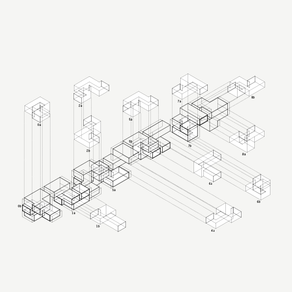

# CAFA 1



Cellular Aggregations for Architecture (CAFA) is an ongoing research into self-organizated cellular structures. CAFA 1 is a set of scripts and methodology for generating context-sensitive cellular aggregations based on clustering linked cell networks. The algorithm, implemented in rhinoscript, can be divided into three isolated stages. The first distributes cellular mass according a simple CA logic and optimizer that adjusts massing for circulation paths and other encoded constraints like site, topographic features, etc. The first stage requires as input an initial massing condition as cellular automata procedes as incremental refinement.[1] First stage is also responsible for constructing a cell network, ie. each cell maintains state and keeps track of neighbooring cells. This network is passed to stage two along with further building constraints like program, floorspace allocation, etc. The second stage subdivides single-cell mass into multi-cell clusters or linked cell chains. This is accompolished by establishing an initial condition of randomly placed conditional units and defining a fitness function that evaluates the placement and situation of the unit and simply discards losers and ignores winners. This is a weak genetic optimization algorithm that is more brute force than anything else, but it does find solutions in reasonable amount of time. The final stage embeds building intellegence into cell clusters, places utility core, and adapts unit to basic building constrains... All stages are intended to be a guided meta-design processes, in which designers participate in real time by making subjective decisions and feeding them back into the system.

## Getting Started

### Dependancies

```
currently no dependancies
```

### How to use tool

<!-- Open sandbox.3dm, launch grasshopper and open sandbox.gh. Should have something like this: -->

<!--  -->

## Context/Roadmap

<!-- Would like to develop this into fully integrated system for subterrainian architecture, that allows users to manipulate user/building constraints in real-time and outputs closed mesh massing for rapid prototyping, and perhaps generates complete set of shop drawings for fabrication :). If you are interested in helping please let me know. -->

## Contributors

**Joshua Parker** - [parkerjgit.github.io](http://parkerjgit.github.io/)

See full list of [contributors](https://github.com/your/project/contributors) who participated in this project. *Currently no contributors*

## Built with

```
Rhinoceros 
Rhinoscript
```

## License

This project is licensed under the MIT License - see the License.txt file for details

## Acknowledgments

Definitions and scripts developed in the context of a project with [OPEN Architecture](www.openarch.com), investigating how to restructure
relationships between people, nature, and the built environment.

<!-- Images copyright (c) 2016 OPEN Architecture. -->

<!--  
 -->
